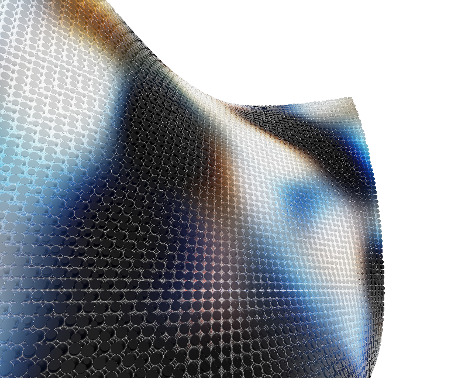
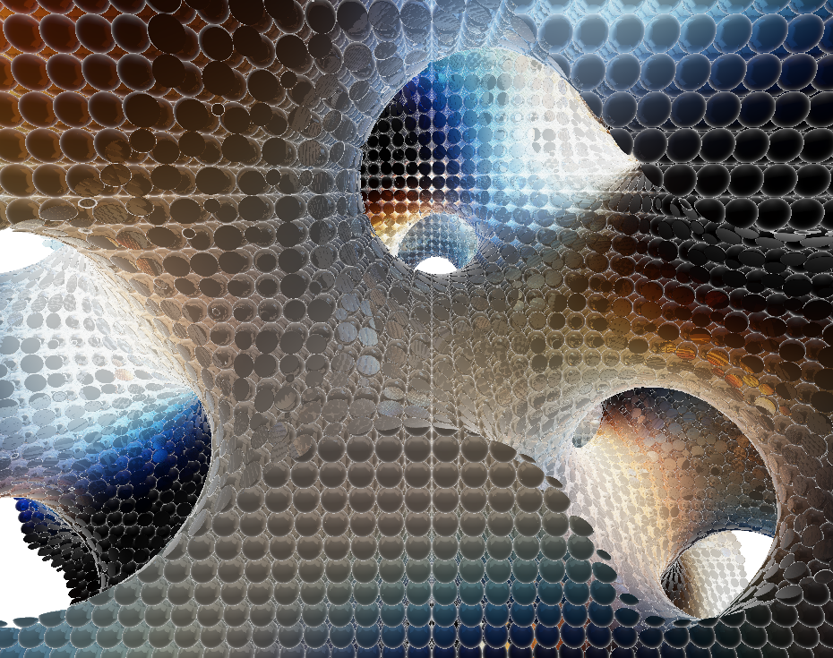
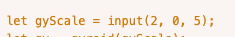
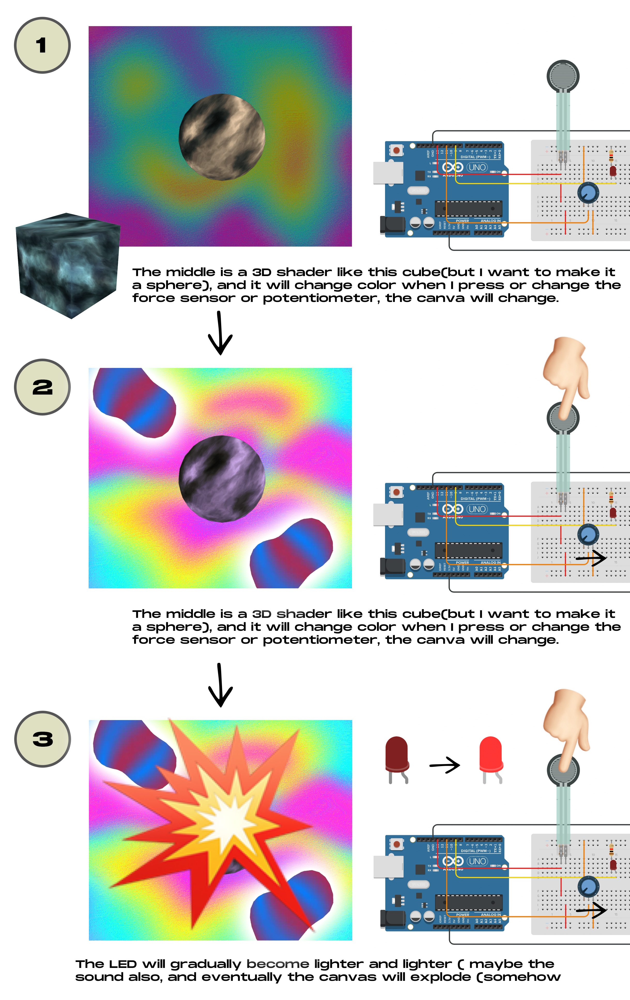
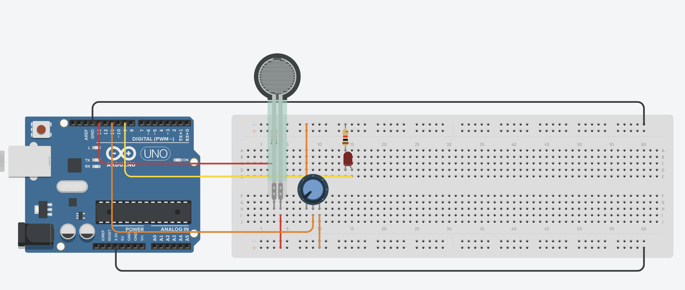
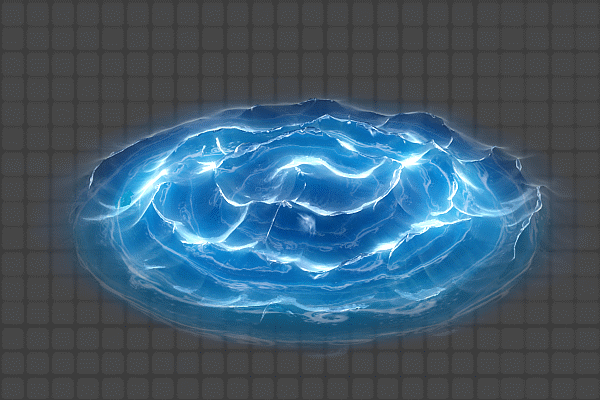
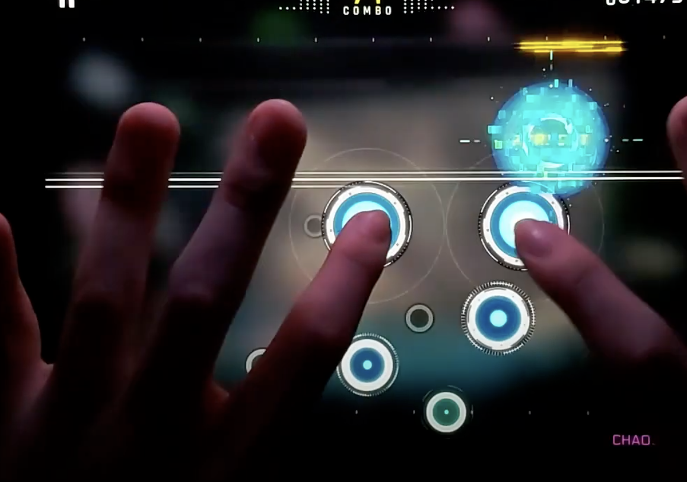

# Final_Work_Milestone 03
Finally complete with the code!!(kind of)
I use the external external libraries called sharppark, but it does not fit well with the P5js, so I struggled for a lot time on how to use it and connect the code with the html.
There is five document in this week's submission, and the third one is the final canvas that I want to present, and I want to use the force sensor to change the gyScale
For example, this is the gyScale=1:

and this is the gyScale = 6

But I dont know why if I want to add input on the spCode, the canvas does not show up, take 4, the original source as example, the tutorial of the shaderpark in html does not correspond if the file has input:

And the file 5 is with the arduino code, my amazon package of the force sensor will deliver at wednesday this week, I will try it then.
### Final_Work Milestone 02
1. High-level system diagram:
I think I will choose the the third one, the shader and the force sensors. I think I will use p5js to create a interactive pattern in particularly present as shader art way. But every interactive the user make is by using the Arduino, they can see how their interact with arduino takes effect on the canvas. And also I'm thinking that I can add some music into the project, like every press it will have a sound, also align with the hardness of the force sensor provide.
This is my thoughts of how my project is like:

2. My Circuit diagram look like this:

The force sensors can detect pressure, this is what I want, if I can capture every pressure change and quantify every change and reflect it on the canvas, like stone skipping into the lake, and because I want to indicate how many pressure the user accumulate make, the accumulation will reflect on the light level of the LED. As for the potentiometer, because I think the color of the shader can be changed, it is cool to give this option to the user.
(I am searching at Amazon about the force sensors, and also will check at IDM's lab.)

3. Description of any external data or library:
I talked to Qiyang Peng, who uses shader as his mid-term project, about how to find some shader, he recommended me to search on openprocessing about shader. I think I will continue to use some, and also see his code.
https://openprocessing.org/sketch/1202168/

4. References:
I want to make a black or dark background, and make every press have effect like this:

https://www.artstation.com/artwork/nQdyVO

This idea comes from my favourite Music Game called Cytus:

https://www.youtube.com/watch?v=LSRYvJilg-8
I like the artistic way it represents every smash on the screen, fair to say, it is my first time to get in touch with interactive digital technology.

Also I saw this video from youtube, the effect is also cool:https://www.youtube.com/watch?v=lKPrqlGlBa0
https://juliaschimautz.com/Colour-Exploration

5. Plan for user testing
I think I will test it among my classmates or my friends, let them try to give force to the force sensor, but do not tell them what will happen eventually, maybe somebody will notice the LED is getting lighter and ask what is happening, or not. I want to see whether they will play at the end.

6. Short discussion of why your project is relevant:
I think my project maybe...... related to the WK05's reading, because it is also about the interaction, but like WK05's reading said, our outcome should have a two-way process. This is what I want to do. I will not tell what will happen in the end, but give the audience their own path to explore, and I also can learn from their actions.
The reason why I want to make a project like this exactly from the society, I want to visualize the pressure that surrounding environment can press to a person, and I want to use canvas to present the human-mind, there are some 3D item, also have some 2D item, both of them are like vague, chaotic. The accumulation of pressure can destroy one person for a moment, but eventually it will "refresh".
This kind of thought is from my experience, I am not that sensitive to my own mental health. It will eventually reaching to the climax of I can tolerant and explode(I think I am reaching to the top right now...(just kidding hahaha)). I think this situation is not just about me, but about everyone.

7. Pseudocode:
I examed some code from openprocessing and try to modify it.

### Final_Work Milestone 01
Here are some ideas that I want to achieve as my final project. Some of it I asked ChatGPT how to accomplish them on the technical part.

1. An interactive art piece that changes visuals based on sound input (e.g., a microphone connected to Arduino).
   The reason why I think about this is because I use Iphone for roughly decades, and I can tell that in America people use Iphone more. I can recall that every year, it definitely be over 3 or 4 times thar siri would accidently pop-up because we said something same as that. Whether I'm saying chinese or english, this thing always happened. And it also remind me of some interesting things (not that appropriate though). <https://www.quora.com/What-is-the-common-Chinese-word-that-sounds-like-nigga-to-American-ears>
   I think I want to use a sound input that will detect the words in people's talking, maybe they are saying the words that is not the incentive one, but this is communication, the misunderstanding.
   

2. A narrative-driven system where users make choices that change the storyline or visuals
  Drawing from my experience designing an RPG game, this system allows users to influence the storyline through their choices. The focus isn't just on the aesthetics of the game interface but on how players interact with it. By secretly tracking the number of button presses, I plan to introduce hidden sub-stories, demonstrating that while choices may seem binary, they can lead to vastly different narrative outcomes.(But I'm a little bit afriad that there are too many "if" appear in my code)
   
  
3. Design a digital art tool where the pressure on force sensors controls brush size, color intensity, or pattern complexity on a canvas.
   Influenced by a student's use of shaders to express concepts in the mid-term, I hope I can use pressure from force sensors to control variables in shader functions, altering brush size, color intensity, or pattern complexity. Additionally, inspired by a recent performance art piece on the dynamics of dominance and submission, visualizing how pressure on skin can translate into sensations of pain or pleasure could offer a compelling exploration of physical and emotional interaction.

   
   
